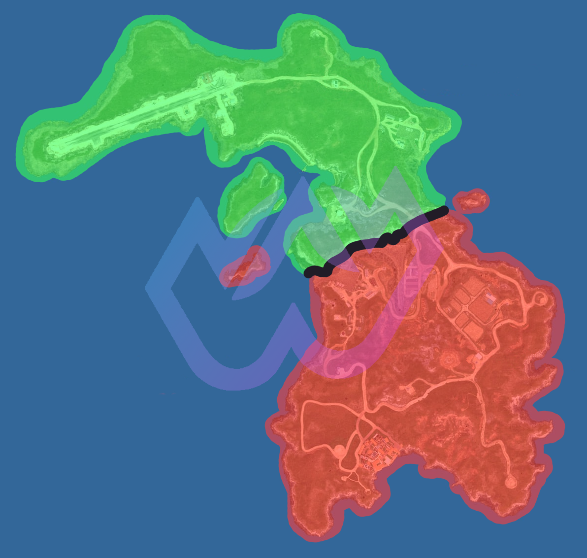
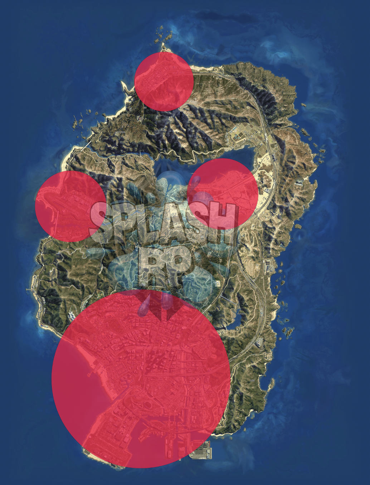

# ⚙️ Pravidla serveru

## <mark style="color:purple;">Bugy</mark>

* Je **přísně zakázáno** zneužívat bugy ve svůj prospěch nebo využívat jakékoliv programy třetích stran.
* Pokud se při některém z bugů naskytnou dvě strany a bug působí rozdílně pro oba celky - bug se neerpí. (situace, kdy by jednu stranu bug zvýhodnil a druhé naopak uškodil)
* Bugy, které nepůsobí ve Váš nebo někoho jiného prospěch se "erpí"

## <mark style="color:purple;">Deathscreen</mark>

* Hráč nesmí pasivně erpit místní EMS, dokud nemá povolený příkaz /respawn - jiný hráč z okolí může zraněnému hráči místní EMS zaerpit.
* Hráč nesmí použít spawn na EMS, pokud se nachází v RP akci a nebo nemá zaRPené místní EMS

## <mark style="color:purple;">Outfity</mark>

* Je zakázáno vydávat se jakýmkoliv způsobem za státní složku (platí také pro oblečení) - EMS/LSPD/LSSD, pokud nejste jejím příslušníkem
* Je zakázáno nosit vesty s nápisi nelegální frakce, do které nepatříte
* **PŘÍKLAD**<mark style="color:blue;">:</mark> Oblečení s viditelnou nášivkou státní složky, vesta CDS

## <mark style="color:purple;">Pravidla LE (LSPD, EMS, LSSD)</mark>

* Korupce se na serveru vůbec nenachází
* Je přísně zakázáno vykrádat frakční sklad
* Pravidlo CPZ - je povoleno držet hráče v CPZ maximálně 24 hodin reálného času - po tuto dobu by mělo LSPD/LSSD dotyčného hráče vyřešit.
* Je zakázáno erpit potenciální GPS lokátor, pokud ho nemáte přimo v inventáři jako item

## <mark style="color:purple;">Cayo Perico</mark>

Na Cayo Perico **smí vstoupit metropolitní jednotky** LSPD a LSSD **pouze v případě**, že zde bude nahlášena **střelba**.

**EMS** na Cayo Perico smí vstoupit pouze pokud je **zavolá** příslušník LSPD/LSSD sboru

❗<mark style="color:red;">**Patrolovovat zde smí pouze zásahové jednotky (SWAT, SRT)**</mark> ❗

Cayo Perico se rozděluje na dvě části:

* 🟢Legální část - Na tomto místě se eRPí Passive
* 🔴Nelegální část - Zde vás může každý unést a ublížit, na tomto místě se Passive neeRPí

<figure><figcaption>
Fotka Cayo Perico ostrovu
</figcaption></figure>

## <mark style="color:purple;">Letový provoz</mark>

* Mapu dosahu letových radarů naleznete níže.
* Pilotování bez leteckého průkazu je zakázáno.
* V místech do kterých dosáhne radar nelze provádět lety mimo zákoník letového provozu, vztahuje se na ně silný Passive.
* Mimo dosah radaru lze používat helikoptéru na nízké přelety, každopádně je čistě na hráčích, zda Vás někdo chytí. (Air Unit)
* Platí přísný zákaz narušení vzdušného prostoru letadlových lodí, základen a státních budov s heliporty.

<figure><figcaption>
Fotka Los Santos ostrovu
</figcaption></figure>

## <mark style="color:purple;">CK</mark>

#### Obecné CK

* K provedení CK musíte mít pádný důvod a provedení řádné RP!
* CK můžete provést zeptáním se osoby do L-OOC a nebo napsáním ticketu
* V případě, kdy si hráč na místě neschválí CK, nelze v RP akci pokračovat a je nutné vytvořit ticket, kde uvede důvody pro udělení CK. Dále je třeba předložit důkazy, které nám ulehčí rozhodování v dané situaci. Schválený ticket je platný do udělení CK danému hráči.
* Před plánovaným CK je zakázáno jakkoliv přepisovat / předávat majetek.
* Po zabití Vaší postavy, se nemůžete vrátit zpět do stejné frakce po dobu 14 dní
* Pokud hráč z jiné nelegální frakce vstoupí na Váš pozemek můžete mu automaticky udělit CK

#### Self CK

* K provedení musí být pádný důvod(y).
* Schválení je na každém hráči.
* Před plánovaným CK je zakázáno jakkoliv přepisovat / předávat majetek.

#### Situační CK

* Zda provedet toto CK je pouze na Vás
* **PŘÍKLAD**: Naražení do benzínky

#### Frakční CK

* Toto CK vám může boss nelegální frakce udělit kdykoliv, pokud v ticketu uvede pádný důvod

## <mark style="color:purple;">Gross</mark>

* Rasismus, pedofilie, řezání jednotlivých končetin a další nechutné prvky.
* Tento styl RP je možné provádět pouze po odsouhlasení od všech účastníků RP akce.
* Pokud se k již probíhajícímu Grossu připojí jakýkoliv další hráč, je nutné tuto akci pozastavit a vyžádat si jeho souhlas - pokud hráč neposkytne souhlas, musí být tato akce okamžitě ukončena!
* Jakákoliv osoba, která se zúčastní GrossRP, může kdykoliv svůj souhlas odvolat, pokud se dané akce nechce nadále účastnit.
* Je zakázáno vytvářet lidem trvalé následky (řezání končetin a jiných částí těla), pokud dotyčné osobě nebude uděleno CK! V případě následného udělení CK dotyčnému hráči, vzniká pro toto pravidlo výjimka.
* Výjimkou pro toto pravidlo je také způsobení poškození jednotlivých částí těla (pořezání a následné jizvy), které nejsou běžně viditelné, protože jsou skryté některou z částí oblečení.
* Pokud RP akce začne v hoodu (obytná část gangu), je GrossRP automaticky povoleno! Nicméně stále k tomuto pravidlu musí proběhnout určitá interakce mezi hráčem a členem gangu.

### iGross

* Toto pravidlo se týká výhradně nelegálních frakcí a skupin.
* Pokud jste členem nelegální frakce/skupinky a odchytí si vás konkurenční nelegální frakce, automaticky je povolený Gross.
* V případě že se vám Gross zdá, být příliš nechutný, můžete si požádat o zmírněni Grossu (ne o zrušení) a protistrana tak musí učinit.

### sGross (starý - SexRP)

* Jedná se o styl Grossu, který se zaměřuje speciálně na sexuální aktivity.
* Je nutné se na něj ptát zvlášť, povolení Grossu samotného nepovolí tento a naopak.

## <mark style="color:purple;">Další pravidla</mark>

### CopBaiting

* Zákaz provokování státních složek

### Multichar

* Vlastníkem frakce můžete být v jednu chvíli pouze na jedné postavě.
* Je zakázáno zařazení jedné postavy u více státních složek najednou. (např. Sheriff a EMS)
* Je zakázáno být v jednu chvíli víckrát členem jedné frakci na různých postavách. Toto se vztahuje také na nelegální frakce, nesmí být u např. Cartel a Mafia.
* Je zakázáno jakýmkoliv způsobem cokoliv převádět z jedné postavy na druhou.
* Je zakázáno aby Vaše aktuální a předešlé postavy byly jakkoliv příbuzné.

### Únosy

* Od rukojmího (unesené osoby) je zakázáno vyžadovat majetek, peníze z bankovního účtu nebo přepsání vozidla.
* Maximální délka únosu/držení hráče je stanovena na 12 hodin reálného času.
* Držení osob v interiérech na teleport je zakázáno!

### Vykrádání

* Unešená osoba musí být při vykrádání uvnitř objektu.
* Zákaz vykrádání obchodu/banky/klenotnictví ve 2 a více frakcích
* Započetí vykrádání je zakázáno 30 minut před i po plánovaném restartu.
* Při vykrádání mají obě strany povinnost vyjednávat a domlouvat podmínky průběhu vykrádání.
* Může se RPit **pasivní rukojmí**, ale jen pokud ho **přivedete z ulice** -> **nesmí** to být prodavač a **jen při vykrádání obchodu**
* Za NPC rukojmí nesmíte požadovat peníze
* Při akci s rukojmím je PD nuceno jednat opatrně! Při vědomí, že má druhá strana rukojmí se snažit dodržet podmínky - strach o rukojmího
* PD mají zakázáno pokládat ostnaté pásy přímo před vozidlo či při výjezdu (později při průběhu ujíždění samozřejmě mohou).
* Je přísný zákaz mít na vykrádání obchodu/klenotnictví/banky domluvené rukojmí OOC. V případě zjištění dostanete ban bez upozornění.

### Gangy

* Gangster je charakteristická postava, která se musí chovat a komunikovat dle svého lore.
* Gangy se erpí passivně.
* DownTown se erpí passivně.
* Při využívání zbraní je třeba myslet na postavení svojí postavy a lore.
* V hoodech a jejich okolí je N-Word povolen, ale pouze v případě, že mezi hráči proběhla patřičná interakce (pullup, drive by, beef). V případě zneužívání může být hráč potrestán.
* Je zakázáno se vydávat za jiný gang.

### Inventář

* Veškeré předměty, které máte v momentální chvíli u sebe (v inventáři), máte u sebe.
* Ke schování jakéhokoliv předmětu nelze využít prostředek, který není mechanikou hry.
* **PŘÍKLAD**: /me schovává zbraň pod sedačku

### Mobilní telefon

* V případě, že se u hráče nachází předmět mobilního telefonu, je možné získat z telefonu informace, ke kterým má postava hráče běžně přístup
* Přítomnost předmětu vyplývá z pravidla inventáře.
  * SMS, Kontakty
  * Historie volání
  * Reddit, Twitter
  * A jiné..

### Frakční Discord

* Na každém frakčním Discord serveru musí být přítomen alespoň jeden člen vedení serveru, kterému po připojení na tento server předáte vlastnictví tohoto serveru.
* V případě, že se na frakčním Discordu nenachází vedení serveru, budou veškeré informace, které jsou využívané v herním světě (IC), považovány jako Metagaming.
